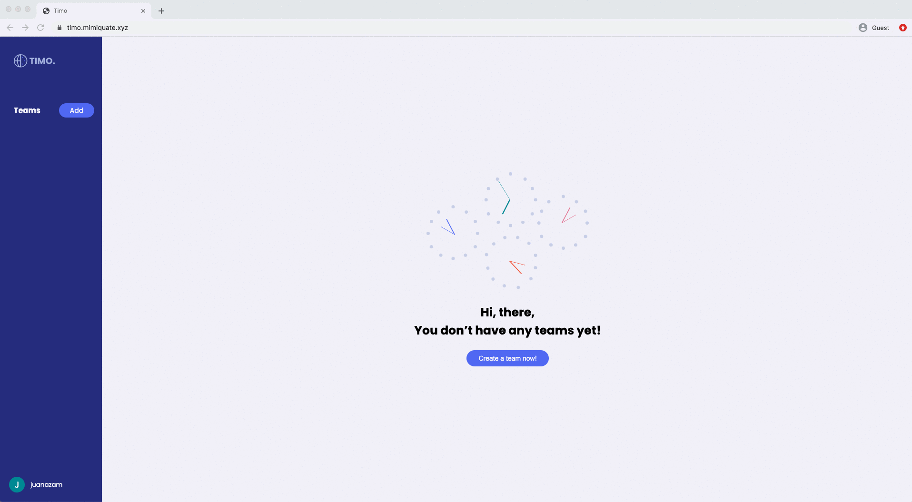
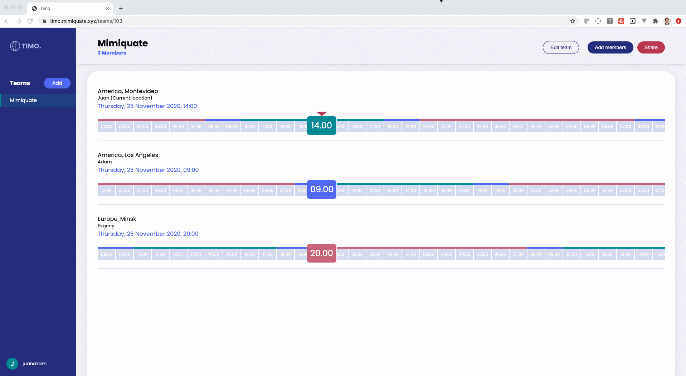

__Web__: https://timo.mimiquate.xyz/

# Introduction

Timo is the solution for scheduling virtual meetings in the remote era.

# Usage

After creating an account in Timo, you will be able to
create multiple teams and add members indicating their timezone.

While on the team's page, you will be able to see each timezone and
identify what time is on all of them. When selecting a time box, all
timezones will scroll so you still know what time is it across all of
them easily.

Clicking on any time box will open a new browser tab on Google
Calendar's create event screen at the selected time.

Also, you can generate a link to let others see your calendar, even if they don't have an account in Timo.

# Pull requests and comments are welcomed

Found any issue? Do you want to suggest a feature or a behavior change?

Don't hesitate to create a pull request or open a issue on this
project.

Thanks!

__Frontend:__ https://github.com/mimiquate/Timo/tree/master/timo_frontend
 
__Backend:__ https://github.com/mimiquate/Timo/tree/master/timo_backend

